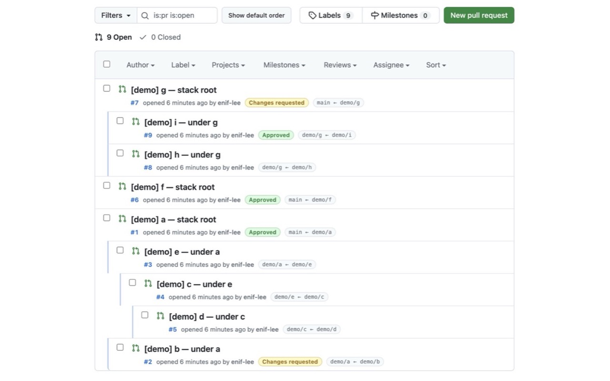

<p align="center">
  
</p>

<h1 align="center">pr+</h1>

<p align="center">
  A Chrome extension that turns the GitHub pull request list into a<br />
  <strong>stack tree</strong> and surfaces branch, review, and magic-link metadata at a glance.
</p>

<p align="center">
  <a href="https://github.com/enif-lee/pr-plus"></a>
  
  
</p>

---

## Overview

GitHub’s default PR list is a **flat sorted list**, so stacked PRs (a PR whose base is another PR’s head) are hard to see.

**pr+** reads `base` / `head` branch relationships for open PRs and:

- reorders the list into a **stack-depth tree** (left indent)
- rebuilds each row’s second meta line into a **compact badge UI**

It keeps the native GitHub list UI and applies a minimal overlay.

### Screenshot

Example pull request list with stack tree, review badges, and `base ← head` branch chips.

<p align="center">
  
</p>

---

## Features

| Feature | Description |
|---------|-------------|
| **Stack tree view** | Links PRs when `baseRef === another PR’s headRef`; shows depth via left indent |
| **Tree / default toggle** | Switch between stack order and GitHub’s default sort |
| **Second-line meta rebuild** | Hides the default “opened by …” line and rebuilds a denser meta row |
| **PR number** | `#123` styled in blue |
| **Author · relative time** | Keeps native author links and `<relative-time>` (hovercards work) |
| **Draft badge** | Draft PRs shown as a pill badge |
| **Review badges** | `Review required`, `Changes requested`, `Approved`, and similar states |
| **Branch badge** | Single muted gray chip: `base ← head` |
| **Magic links** | When a repo autolink rule matches title/branch, adds an external ticket shortcut |
| **Private repos** | Optional GitHub PAT in the extension popup for reliable API access |
| **SPA support** | Re-applies tree and meta after Turbo/soft navigation and DOM refresh |

### Meta line example

```text
#13927  opened 2 hours ago by alice  ·  Review required  ·  ENG-42  ·  trunk ← feat/foo
```

---

## Install

### Developer mode (local)

1. Clone this repository.
2. Open Chrome → `chrome://extensions`
3. Enable **Developer mode**
4. Click **Load unpacked**
5. Select this repository root (the folder that contains `manifest.json`)

### Packaged ZIP

To build a release ZIP:

```bash
# packaging example
mkdir -p dist/pr-plus && cp manifest.json dist/pr-plus/ && cp -R src dist/pr-plus/
cd dist && zip -r pr-plus.zip pr-plus
```

Unzip and **Load unpacked** the same way.  
(`dist/` is not committed.)

---

## PAT (Personal Access Token)

Use a PAT for private repositories or autolink lookups.

1. Click the **pr+** toolbar icon  
2. Paste a GitHub PAT and click **Save**  
3. Refresh the pulls page  

| Item | Details |
|------|---------|
| Storage | `chrome.storage.local` (extension-only, not synced) |
| Access | **Service worker only** holds the raw token — never sent to content scripts |
| UI | After save, only a mask is shown (`••••` + last 4 chars) |
| Recommended scope | **Pull requests: Read** on the target repos (fine-grained preferred) |

Public open PR lists work **without** a token.

---

## Usage

1. Install the extension, then open any repository’s **Pull requests** list  
   (`https://github.com/{owner}/{repo}/pulls`)
2. The list is reordered and indented by stack depth
3. Use **Show default order / Show stack tree** near the header to toggle
4. (Optional) Set a PAT in the popup

---

## Permissions

| Permission | Purpose |
|------------|---------|
| `storage` | Store the PAT locally |
| `https://github.com/*` | Enhance the PR list DOM |
| `https://api.github.com/*` | Open PR list, single-PR fetch, autolink API |

---

## Development

```bash
npm install   # jsdom and test deps
npm test      # node tests/run-all.js
```

### Layout (summary)

```text
src/
  background.js          # PAT + GitHub API (service worker)
  content-bridge.js      # content ↔ background messaging (no token in page)
  content-bootstrap.js   # bootstrap / SPA watch
  content.js             # content script entry
  dom.js                 # row discovery, indent, meta UI
  fetch-pulls.js         # list / dangling / autolink
  storage.js             # chrome.storage.local helpers
  tree.js                # pure tree builder
  popup.html / popup.js  # PAT settings UI
  styles.css
```

---

## Privacy

See **[PRIVACY.md](./PRIVACY.md)** for how pr+ handles data and optional GitHub PATs.

Chrome Web Store privacy policy URL (public):

```text
https://github.com/enif-lee/pr-plus/blob/main/PRIVACY.md
```

---

## License

Intended for personal and team use. Update this section if you add a license file.
