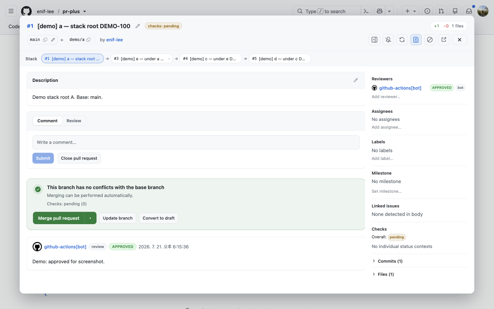
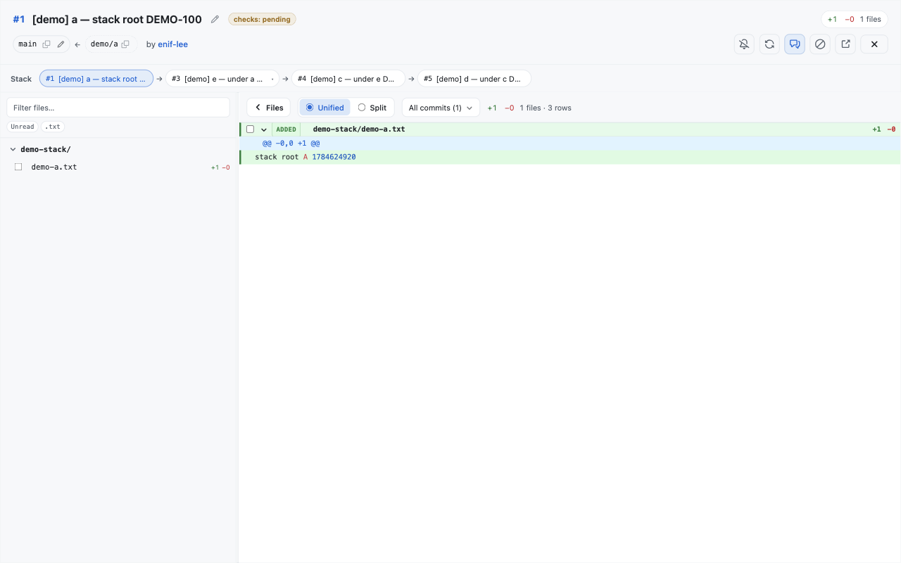
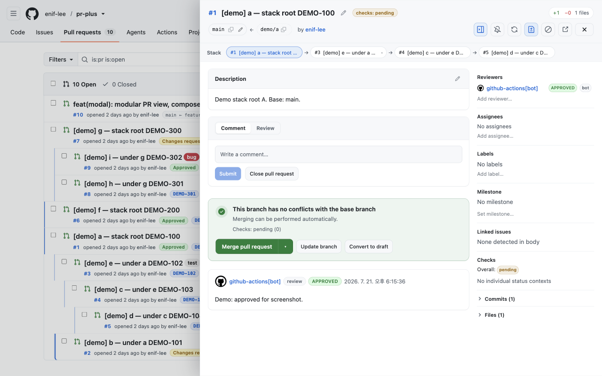

<p align="center">
  
</p>

<h1 align="center">pr+</h1>

<p align="center">
  A Chrome/Edge extension for GitHub pull requests:<br />
  <strong>stack-aware PR lists</strong> and an
  <strong>ultra-fast in-page review modal</strong><br />
  so you can review without leaving the pulls page.
</p>

<p align="center">
  <a href="https://github.com/enif-lee/pr-plus"></a>
  
</p>

---

## Why pr+?

| Value | What you get |
|-------|----------------|
| **Review without page navigation** | Click a PR on `/pulls` → full **modal** or **side sheet**. Stay on the list; no full PR page hop. |
| **PR page embed** | On `/pull/N`, replace the native PR body with the **same pr+ shell** (full window); restore GitHub UI anytime. |
| **Ultra-fast, progressive open** | **List sketch → durable cache → live network** so the shell paints **synchronously** on click, then **incremental** fills refine the data. |
| **Cache-first, soft revalidate** | Memory + **IndexedDB** cache with background refresh—writes stay snappy without cold remounts. |
| **Butter-smooth Diff** | **Range-gated virtualization**, syntax-highlight **cache**, and zero per-pixel app re-renders while you scroll. |
| **Stack visibility** | List reorders into a base/head **stack tree**; the shell shows a **stacked PR strip** (horizontal scroll) for the current chain. |
| **Review workflow in one place** | Conversation, Diff, leave review, line comments, suggestions, filters, subscribe, merge—without bouncing GitHub tabs. |

GitHub’s default PR list is flat. Stacked PRs (base = another PR’s head) are hard to see, and opening each PR is a full navigation. **pr+** keeps you on the pulls list and layers a high-performance review UI on top.

### Screenshots

#### Pulls list — stack tree

Example list with stack indent, review badges, and `base ← head` branch chips.

<p align="center">
  
</p>

#### PR review surfaces

Open a title from `/pulls` without leaving the page.

| Layout | Description | Preview |
|--------|-------------|---------|
| **Conversation** | Centered modal: description, leave-review, merge box, timeline |  |
| **Diff** | Files tree + unified/split hunks in the same modal shell |  |
| **Side sheet** | Docked right-hand panel; pulls list stays visible on the left |  |

Assets: [`conversation`](./screenshots/pr-view-conversation-1280x800.png) · [`diff`](./screenshots/pr-view-diff-1280x800.png) · [`side sheet`](./screenshots/pr-view-side-sheet-1280x800.png)

---

## Features

### 1. Pulls list overlay (stay native)

| Feature | Description |
|---------|-------------|
| **Stack tree view** | Links PRs when `baseRef === another PR’s headRef`; depth via left indent |
| **Tree / default toggle** | Switch stack order ↔ GitHub’s default sort |
| **Compact meta row** | Denser second line: number, author, time, review state, branches |
| **Draft / review badges** | Draft pill; review states (`Review required`, `Changes requested`, `Approved`, …) |
| **Branch badge** | `base ← head` chip |
| **Magic links (list)** | Repo autolink rules on title/branch/body → external ticket shortcuts on the list |
| **Private repos** | GitHub PAT in the popup (required to activate the extension) |
| **SPA support** | Re-applies tree/meta after Turbo soft-nav and DOM refresh |
| **Instant list → modal handoff** | Title, labels, assignees, and milestone from the **list sketch** seed the modal before the network returns |

Meta line example:

```text
#13927  opened 2 hours ago by alice  ·  Review required  ·  ENG-42  ·  trunk ← feat/foo
```

### 2. In-page PR review (no full-page navigation)

Open a PR title from the list → **centered modal** or **side sheet** on the **same** `/pulls` page.

#### Speed, cache & progressive load

| Feature | Description |
|---------|-------------|
| **Progressive open** | **List sketch → IndexedDB cache → live API**—paint the shell **fast**, then **incrementally** refine body, threads, and files |
| **Parallel fetch** | PR core, files, comments, reviews, commits, checks, and subscription load **concurrently** (not waterfall) |
| **Multi-layer cache** | In-memory SWR + **durable IndexedDB** so reopen is near-instant; patches revalidated on demand |
| **Soft revalidate / incremental update** | Background refresh after open and after writes—no cold remount, no full-page spinner |
| **Load status in header stats** | The **+add / −del / files** badge morphs to short progress labels while metadata and threads stream in (no floating pill / top bar) |
| **Dual-window review threads** | Newest + oldest thread windows load **incrementally**; **Load more / Load all** when you need the full set |
| **Virtualized Conversation** | Long timelines stay **fast** with variable-height virtual rows |
| **Thread step nav** | `⌥J` / `⌥K` steps timeline units (and Diff review threads); focus pin ~24px from scroller top |
| **Conversation focus** | `⌥⇧C` seed / clear keyboard focus on a timeline unit for fold / reply / goto-diff context chords |
| **Butter-smooth Diff scroll** | **Range-gated virtualization** (React only when the visible window changes), **highlight cache**, no per-pixel global store thrash |
| **Key-hold thrift** | Held chords **coalesce** per animation frame: **file hops skip intermediate files**, page/comment scroll is **DOM-first**, selection moves rAF-batch |
| **Session restore** | Layout (conversation/diff), shell (modal/sheet), collapse, viewed files, scroll restored after soft refresh |
| **Deep-link routing** | `prp_page` / `prp_number` (and position) so shareable open state survives reloads; cleared on close |
| **Theme-aware UI** | Follows GitHub light/dark color mode |

#### Shells & chrome

| Feature | Description |
|---------|-------------|
| **Centered modal** | Full-focus overlay for deep review; **resizable** (corner drag, viewport-aware clamps) |
| **Side sheet** | Docked panel—**keep the PR list visible** while you review; **resizable** width |
| **Fullscreen shell** | Expand the panel to the viewport (header control + shortcut) |
| **PR-page embed** | On a GitHub PR URL, mount pr+ **full-window** under (and covering) the native PR main; **Open pr+** chip on the GH header when embed is off |
| **Restore native PR** | Leave embed and show stock GitHub PR UI again (header control) |
| **Stacked PR strip** | Horizontal stack path strip; **wheel → scroll**, floating thumb, sticky **Stack** label |
| **Floating scrollbars** | Overlay thumbs on conversation, aside, **file tree**, **diff list**, and **stack strip**; idle-hide, no classic gutter |
| **Soft edge fade** | Scroll content dissolves at the panel edges instead of a hard clip |
| **Header (conversation)** | Two-row chrome: title cluster (edit hugs title), branch + stats, actions always inline (title shrinks when narrow—no ⋯ collapse) |
| **Header (Diff compact)** | Dense strip: title · **reviewer avatars + check icons** (one continuous left-on-top stack) · branch · diff stats · actions |
| **Cancel in-flight load** | Closing the sheet / superseding open **aborts** pending GitHub fetches (content + service worker) |
| **FOUC-safe paint** | Content CSS gated until styles are ready—no unstyled flash on first open |
| **List warm-up** | After pulls list paint, warm prefs/CSS/host so the next open’s first paint stays sync |

#### Conversation

| Feature | Description |
|---------|-------------|
| **Description** | Markdown body with write/preview edit |
| **Timeline** | Reviews, issue comments, review threads with code snippets; dual-window pagination |
| **Mermaid diagrams** | `` ```mermaid `` `` fences render inline (lazy engine); **handDrawn** look; light **neutral** / shell **dark** theme |
| **Diagram fullscreen** | **자세히 보기** / double-click → fit-to-stage viewer; **scroll or pinch zoom**, **drag pan**; Esc closes the viewer only |
| **Syntax highlight** | Fenced code blocks via **lazy highlight.js** language chunks (including Dockerfile and common langs) |
| **Entity links** | Authors, `@mentions`, labels, `#issue` refs → GitHub URLs |
| **Magic links (modal)** | Autolink keys from title/body/branch linked in description & comments |
| **Unified leave-review** | **Comment** / **Approve** / **Request changes** on one form (pending line comments attach on submit) |
| **Edit / delete own comments** | Issue and review comments (including thread replies) |
| **Reply composer focus** | Thread reply actions appear when the reply field is focused (or draft text remains) |
| **Merge box status** | Clear merge readiness; **GitHub-style check groups** (required / optional) with expandable lists |
| **Compact meta rail** | Collapsed right rail: reviewers / assignees / checks / labels as avatar stacks and status chips; hover tips open over the conversation (not clipped by the splitter) |
| **Side panel toggle** | `⌥B` collapses / expands the Conversation meta rail (same chord collapses the Diff file tree) |
| **Profile avatars** | GitHub profile images for authors and pickers |
| **Context chords on focused thread** | With a focused timeline unit: `⌥F` fold/expand, `⌥D` open Diff at the thread (~⅓ viewport), `⌥C` focus reply composer |
| **Conversation scroll chords** | `⌥↑` / `⌥↓` nudge the timeline; `⌥⇧↑` / `⌥⇧↓` page-scroll ~one viewport |

#### Diff & code review

| Feature | Description |
|---------|-------------|
| **Files tree** | Nested dirs, extension multi-select, unread filter, collapse, mark-as-viewed (session); **floating scrollbar** |
| **File step nav** | Prev/next file from the **current** file (`⌥⇧[` / `⌥⇧]`) beside the tree search; list focus scrolls into view |
| **File hold coalesce** | Holding `⌥⇧[` / `⌥⇧]` **accumulates steps** and jumps multiple files in **one** update (no intermediate re-render storm) |
| **Collapsible / resizable file nav** | Focus the hunk pane when you need width; `⌥B` collapses the tree |
| **Single-file Diff mode** | Optional preference: hunk list shows **only the active file** (tree + next/prev still cover the full set). **Off by default** |
| **Unified / split** | Diff modes |
| **Expand omitted context** | Grow gaps between hunks (chunk / all) without reloading the PR |
| **Commit-range filter** | Single commit or inclusive range—**fast** compare without leaving Diff |
| **Review filters** | **Unresolved / Resolved / Pending** counts and file-set filtering for triage (`⌥U` / `⌥R` / `⌥P` toggle on Diff) |
| **Floating Diff controller** | Bottom-right icon strip: prev/next file, page scroll, **Goto** `path:line[:line]` (or bare `line[:line]` on the current file) |
| **Keyboard page scroll** | `⌥⇧↑` / `⌥⇧↓` move the Diff list by about one viewport (**DOM-only** under key-hold—no DiffWorkspace re-render per hop) |
| **Line selection** | Single click, multi-line drag, or **Shift-click range** in the same file; arrows move the caret, **Shift+arrows** extend (plain arrows collapse back to single-line) |
| **Selection multi-jump** | `⌥↑` / `⌥↓` on Diff jump the caret by ~8 selectable lines (rAF-coalesced under hold) |
| **Selection island** | Comment / copy / dismiss docked to the selection; Esc cascades comment → actions → dismiss (modal stays open) |
| **Line comments** | Immediate post or **pending review** batch |
| **Pending review CTAs** | Diff toolbar Submit / Approve / Request changes; **Approve & Request changes hidden on your own PR** (GitHub rejects self-review) |
| **Viewed toggle** | Mark the active file viewed/unread (`⌥⇧R` on Diff); checkbox tip only on the focused file |
| **Inline threads** | Reply, resolve/unresolve, edit/delete; collapse-aware virtual heights |
| **Image / binary diffs** | Images render in-diff; non-text binaries stay header-only; huge files can start collapsed |
| **Suggestions** | Render ````suggestion` blocks; **Apply suggestion** (commit to head) |
| **View-scoped Find (`⌘F` / `Ctrl+F`)** | Search **only the active surface**—Conversation corpus *or* Diff rows—no cross-view noise |
| **Markdown-preserving marks** | Search highlights keep code/markdown structure (no plain-text wipe) |
| **Async chunked search** | Large corpora scan **incrementally** so typing stays responsive |
| **Shared StepNav** | Prev/next for **threads** and **finder** hits (including **⌥J / ⌥K** where enabled) |
| **Comment nav** | Jump prev/next inline review comments without layout thrash |
| **Opt-hold tips** | Hold **⌥** for shortcut badges; tips **clear as soon as a chord fires** (until you release Opt) |

#### Metadata & lifecycle

| Feature | Description |
|---------|-------------|
| **Title / body / base** | Edit title, description, change base branch |
| **Draft stage** | Convert to draft / mark ready for review (GraphQL) |
| **Reviewers / assignees / labels** | Searchable pickers with avatars; **repo label catalog + colors** in the label picker; re-request review |
| **Milestone** | Set / clear |
| **Linked issues** | Detected from body (`#N`, closing keywords) |
| **Subscribe** | Optimistic GraphQL subscription toggle + header tip states |
| **Close / reopen** | PR state (close control uses danger styling) |
| **Merge** | Merge / squash / rebase (when allowed) |
| **Update branch** | Sync head with base — button only when head is **behind** base (`behindBy` / `mergeable_state: behind`) |
| **Clear local cache** | Popup action to wipe **IndexedDB** detail cache when you need a hard reset |

#### Command palette & shortcuts

| Feature | Description |
|---------|-------------|
| **Linear-style palette** | `⌥⇧K` for the pr+ palette (GitHub’s site `⌘K` / `Ctrl+K` is left to GitHub; Escape there no longer closes the pr+ shell) |
| **Shared actions** | Labels, assignees, reviewers, base, review submit, merge, open GitHub, focus comment, … |
| **Diff review filters** | `⌥U` / `⌥R` / `⌥P` — Unresolved / Resolved / Pending (toggle off with the same key) |
| **Diff navigation** | File `⌥⇧[` `⌥⇧]`, page `⌥⇧↑` `⌥⇧↓`, viewed `⌥⇧R`, Goto via floating **:** control |
| **Conversation navigation** | Thread `⌥J` `⌥K`, seed/clear focus `⌥⇧C`, panel `⌥↑` `⌥↓`, page `⌥⇧↑` `⌥⇧↓` |
| **Context on focused unit** | `⌥F` fold · `⌥D` goto Diff · `⌥C` reply (active panel only) |
| **Button shortcuts** | Primary actions show kbd hints; Opt-hold badges hide right after a chord fires |
| **Multi-host PAT** | Default token for **github.com** only; up to **3 enterprise host↔PAT** pairs (no accidental enterprise use of the default PAT) |
| **Popup options** | Auto-open embed, fast review load, reverse comments, **single-file Diff mode** |

### Keyboard quick reference (modal)

| Chord | Action |
|-------|--------|
| `⌘F` / `Ctrl+F` | Find in the active surface (Conversation *or* Diff) |
| `⌥.` | Toggle Conversation ↔ Diff |
| `⌥J` / `⌥K` | Next / previous thread (or Find hit when Find is open) |
| `⌥⇧C` | Seed / clear Conversation keyboard focus |
| `⌥F` / `⌥D` / `⌥C` | Fold / goto Diff / reply on the **focused** unit |
| `⌥↑` / `⌥↓` | Conversation: panel scroll · Diff: multi-line selection jump (~8 rows) |
| `⌥⇧↑` / `⌥⇧↓` | Page scroll (~0.9 viewport) on the active list |
| `⌥⇧[` / `⌥⇧]` | Previous / next file (from current file; **hold coalesces**) |
| `⌥B` | Toggle side panel (Conversation rail / Diff file tree) |
| `⌥U` / `⌥R` / `⌥P` | Toggle Unresolved / Resolved / Pending file filter |
| `⌥⇧R` | Toggle viewed on the **current** Diff file |
| `↑` / `↓` | Move line selection (seeds first line of file if none) |
| `⇧↑` / `⇧↓` | Extend line selection range |
| `⌥⇧K` | pr+ command palette |
| `Esc` | Nested UI → blur editable → close shell (hierarchy) |

Full browser QA checklist: **[docs/qa-browser-scenario.md](./docs/qa-browser-scenario.md)**.  
Deep matrix of GitHub PR-view vs modal: **[docs/github-pr-parity.md](./docs/github-pr-parity.md)**.

---

## Install

### Developer mode (local)

1. Clone this repository.
2. `npm install && npm run build` (builds the modal bundle, CSS, Mermaid chunk, and hljs language packs under `src/modal/dist/`).
3. Open Chrome or Edge → `chrome://extensions` (or `edge://extensions`).
4. Enable **Developer mode**.
5. **Load unpacked** → select this repository root (folder that contains `manifest.json`).

### Packaged ZIP

```bash
npm install && npm run package
# → dist/pr-plus-<version>/ and dist/pr-plus-<version>.zip
```

Unzip and **Load unpacked**, or point **Load unpacked** at the unpacked folder under `dist/`.

---

## PAT (Personal Access Token)

**A PAT is required to activate pr+.** Until a token is saved, the extension stays **inactive** on GitHub pages (no list tree, no modal intercept) so the site works exactly like stock GitHub.

1. Click the **pr+** toolbar icon  
2. Paste a GitHub PAT → **Save**  
3. Refresh the pulls page (features enable automatically)  

The popup also lists **Chrome permissions** and recommended **PAT scopes** (classic `repo` / fine-grained Pull requests ± Contents).

| Item | Details |
|------|---------|
| Storage | `chrome.storage.local` (extension-only, not synced) |
| Access | **Service worker only** holds the raw token — never exposed to content scripts |
| UI | After save, only a mask is shown (`••••` + last 4 chars) |
| Classic scopes | `repo` for full PR features; add `notifications` for Subscribe |
| Fine-grained | **Pull requests** Read & Write on target repos; **Contents** Read & Write if applying suggestions or attaching files |

---

## Usage

1. Open a repository **Pull requests** list:  
   `https://github.com/{owner}/{repo}/pulls`
2. **List:** stack indent, badges, branch chips, magic links (if configured).
3. Toggle **Show default order / Show stack tree** near the header.
4. **Review:** click a PR title → **modal** opens (no navigation away from `/pulls`).
5. Use Conversation / Diff, leave review, edit metadata, or `⌘K` for the command palette.
6. Optional: switch **side sheet** or **fullscreen** from the header. See [screenshots](#screenshots) above.
7. Esc / close returns to the list. **Refresh while the modal is open** restores the modal (and Diff layout) after the stack list re-applies.
8. Diagrams: mermaid fences render in comments; open fullscreen for pan/zoom. Code fences pick up lazy language highlighting as needed.

---

## Permissions

Declared in the extension manifest (also summarized in the popup settings UI):

| Permission | Purpose |
|------------|---------|
| `storage` | Store the PAT and options locally |
| `scripting` | Register content scripts on enterprise web hosts |
| `https://github.com/*` | github.com list overlay + modal host |
| `https://api.github.com/*` | github.com REST / GraphQL |
| optional `https://*/*` | Self-hosted / Enterprise hosts (granted from the popup) |

### GitHub Enterprise / self-hosted (multi-account)

pr+ uses a **default PAT for github.com only**. Each enterprise host needs its **own host↔PAT pair** (max **3** hosts). Unregistered hosts — including `*.ghe.com` — do **not** use the default PAT.

1. Open the **pr+** popup.
2. Save the **github.com PAT** (public cloud) if you use github.com.
3. Under **GitHub Enterprise (host + PAT)**, enter both the **web host** and a **PAT for that host**, then **Add host & grant access**.
4. Accept the Chrome permission prompt; reload the enterprise tab.
5. API is **auto-derived** from the web host:
   - **github.com** → `https://api.github.com` (+ `/graphql`)
   - **GHES** → `https://{host}/api/v3` + `https://{host}/api/graphql`
   - **GHE Cloud** (`subdomain.ghe.com`) → `https://api.subdomain.ghe.com` (+ `/graphql`)

Content scripts run on github.com (manifest) and on **registered** enterprise hosts only.

---

## Development

```bash
npm install
npm run build              # full extension build pipeline
npm run package            # versioned zip under dist/
npm test                   # build + rstest unit suite
npm run test:unit          # rstest only (no rebuild)
npm run check              # typecheck + lint + unit
npm run test:e2e           # local agent-browser e2e (features + key-hold perf) — not in CI
npm run test:e2e:features  # feature / style / layout scenario
npm run test:e2e:perf      # key-hold scroll + selection budgets
```

Local e2e needs a logged-in browser profile (`npm run browser:login` once) and a built workspace. See **[tests/e2e/README.md](./tests/e2e/README.md)**.

### Architecture notes (1.7)

| Area | Approach |
|------|----------|
| **TypeScript SoT** | Fetch, content-bridge, service worker, host modules, content entries, and modal shells are complete TS sources (not mid-IIFE “parts” dumps) |
| **Colocated CSS** | Domain styles live next to components (`import './Foo.css'`); `build-modal` collects the TSX graph → `pr-modal.css` (tokens + Tailwind via `styles/entry.css`) |
| **Data-group stores** | Zustand leaf subscriptions so Diff scroll / selection / filters re-render only their consumers |
| **Host modules** | Semantic host assembly order (detail store, embed/progress, open/render, lifecycle, …) |

### Layout (summary)

```text
src/
  background/sw-api.ts → background.bundle.js   # PAT + GitHub API (SW only)
  content-bridge/       → content-bridge.js
  host/modules/         → pr-modal-host.js      # intercept / mount / session
  fetch/fetch-api.ts    → fetch-pulls.js
  content*.ts / tree.ts / dom.ts / storage.ts   # list + pure stack
  popup.html / popup.ts
  styles.css                                    # list overlay styles
  modal/
    main.tsx                                    # entry; imports styles/entry.css
    app/ PrModalApp.impl.tsx                    # composition root
    views/  conversation | diff | chrome | pr-modal
    components/common/                          # Button, Markdown, TipPopover, …
    lib/ + pure/                                # helpers (rstest pure paths)
    styles/ entry.css + tokens.css              # Tailwind + design tokens
    dist/                                       # bundle, CSS, mermaid, hljs-langs
tests/
  *.rstest.ts                                   # unit + architecture gates
  e2e/                                          # local agent-browser scenarios
```

---

## Privacy

See **[PRIVACY.md](./PRIVACY.md)** for data handling and optional GitHub PATs.

Chrome Web Store privacy policy URL (public):

```text
https://github.com/enif-lee/pr-plus/blob/main/PRIVACY.md
```

---

## License

Intended for personal and team use. Update this section if you add a license file.
