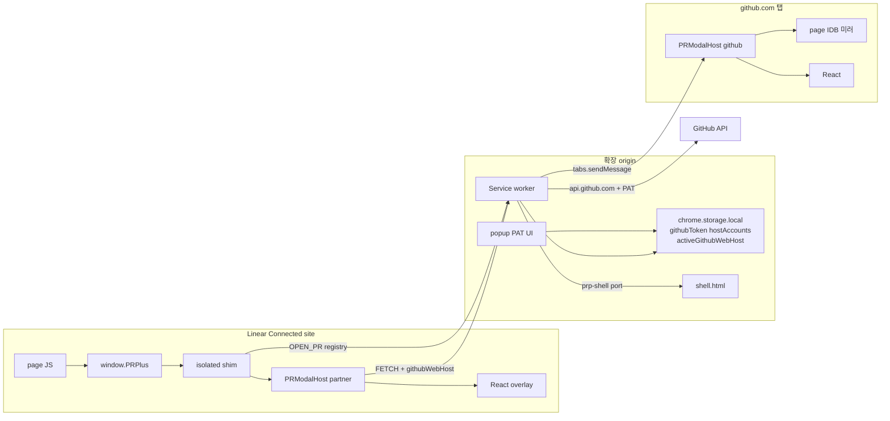
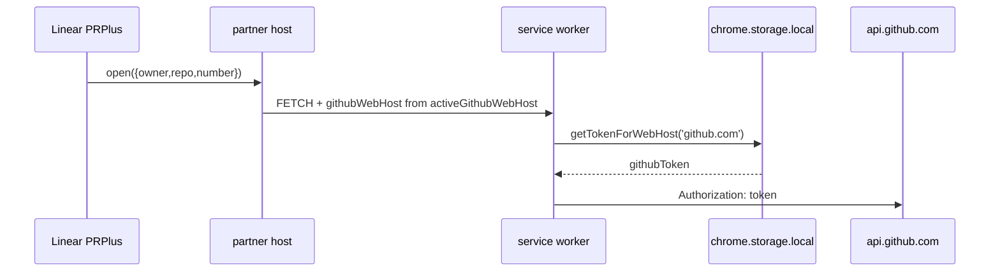

# pr+ 외부 호스트 연결 · `PRPlus` 페이지 API · 확장 소유 PAT 조회

| 항목 | 값 |
|------|-----|
| **문서 제목** | Reachable Plugin + Page API + Extension-Owned Token Selection |
| **작성** | TBD (pr+ maintainers) |
| **날짜** | 2026-08-18 |
| **상태** | Accepted (final — no cache migration) |
| **대상 저장소** | `/Users/ed/personal/pr-plus` (Chromium MV3, `manifest.json` version `1.10.2`) |
| **도메인** | GitHub PR 리뷰 전용. 멀티 포지 제품이 **아님**. |

---

## Overview

pr+는 오늘 github.com(및 등록 GHES) 탭 안에서만 산다. Isolated `PRModalHost.openModal`은 페이지/`eval`이 볼 수 없고, 매니페스트에 `externally_connectable`이 없어 외부 사이트는 확장에 말을 걸 수 없다.

**PAT는 이미 확장 금고에 있다.** [`src/storage.ts`](src/storage.ts)가 `chrome.storage.local`의 `githubToken`(dotcom)과 `hostAccounts`(GHES)를 소유한다. 팝업과 SW만 읽고 쓴다. 페이지 IndexedDB가 아니다.

Linear에서 fetch가 실패하는 이유는 금고가 비어서가 아니라, 브리지가 `location.hostname`(`linear.app`)을 조회 키로 붙이기 때문이다. [`selectTokenForWebHost`](src/github-endpoints.ts)는 미등록 호스트에 `{ token: null }`을 주고, API 베이스도 `https://linear.app/api/v3`로 붕괴한다.

PR 상세 영속 계층은 **페이지 origin IDB가 아니라 확장 서비스 워커 IndexedDB**다. GitHub·Linear·셸이 같은 캐시를 읽고 쓴다. `openModal`의 `peekDetailIdb`는 SW IDB를 조회한다.

푸는 것:

1. **정책** — 사용자 허가 하에 외부 사이트가 확장에 도달하고, 확장이 그 사이트에 스크립트를 주입한다.
2. **`window.PRPlus`** — MAIN-world 공개 API (`open` / `close` / `status` / `ping` / `version`).
3. **PAT 조회 주체** — 어느 칸을 열지는 확장 설정(`activeGithubWebHost`)과 선택적 `githubHost` 인자. 탭 주소가 아니다.
4. **Linear opener-embed** — 허가된 Linear 탭에 Conversation/Diff 오버레이. Jira는 런처만.

---

## Background & Motivation

### 현재 상태

| 사실 | 근거 |
|------|------|
| 정적 CS = `https://github.com/*` only | [`manifest.json`](manifest.json) |
| `optional_host_permissions` = `https://*/*` 이미 있음. `http://*/*` 없음 | 동 파일; [`tests/content-scripts-injection.rstest.ts`](tests/content-scripts-injection.rstest.ts) |
| `externally_connectable` / `nativeMessaging` / `OPEN_PR` 없음 | manifest, [`src/sw-messages.ts`](src/sw-messages.ts) |
| Isolated `PRModalHost.openModal`은 페이지 불가 | [`click-intercept.ts`](src/host/modules/click-intercept.ts) |
| PAT = `chrome.storage.local` | [`storage.ts`](src/storage.ts) `githubToken`, `hostAccounts` |
| PAT UI = 팝업 + GH 온보딩. 둘 다 SW `TOKEN_SET` | [`popup.ts`](src/popup.ts), [`content.ts`](src/content.ts) |
| CS는 토큰 읽기 금지 | [`bridge-prefs.ts`](src/content-bridge/bridge-prefs.ts) `getGithubToken()` reject |
| `send()`가 `webHost = location.hostname` | [`bridge-channel.ts`](src/content-bridge/bridge-channel.ts) |
| 미등록 호스트 → token null | [`selectTokenForWebHost`](src/github-endpoints.ts) L106–127 |
| overlay 마운트는 GH 노드 불필요 | `ensureHost()` → `document.documentElement` |
| IDB hydrate는 선택 | `peekDetailIdb(key, 400)` 후 네트워크 ([`open-modal-run.ts`](src/host/modules/open-modal-run.ts)) |
| Detail 캐시는 **확장** origin IDB | SW `pr-plus-detail-cache`. Linear/GitHub 공유 |

### 고통

- 트래커/에이전트에 공식 호출 표면이 없다.
- Linear 탭에서 `webHost=linear.app` → PAT 미사용 + 잘못된 API 베이스.
- 금고와 조회 키가 분리되어 있다. 이전이 아니라 **조회 주체** 문제다.

---

## Goals & Non-Goals

### Goals

1. default-deny. 사용자 제스처로 외부 HTTPS·localhost가 확장에 명령을 보낸다.
2. 허가 페이지에 `window.PRPlus` (`open` / `close` / `status` / `ping` / `version`).
3. `open` 신원은 기존 `{owner,repo,number}` + deeplink. 두 번째 모델 없음.
4. PAT 보관은 현행 `chrome.storage.local`을 유지한다. **어느 GitHub에 붙을지**는 확장이 고른다.
5. Linear Connected site에서 `PRPlus.open`이 그 탭 오버레이를 연다.
6. Host-first Domain SoT 유지. IDB는 GH 탭 미러일 뿐, 오픈 전제가 아니다.
7. CWS single purpose(“GitHub PR 리뷰”). Linear는 런처+오버레이 표면이다.

### Non-Goals (v1)

- **캐시·레이아웃·세션 스냅 마이그레이션.** 페이지 IDB/`localStorage`/`sessionStorage`를 확장 origin으로 복사·cutover하지 않는다.
- 확장 origin IDB, `unlimitedStorage`, `DETAIL_CACHE_*` RPC, `SESSION_VIEW_*` RPC.
- Jira DOM 임베드. Jira는 `PRPlus` 런처만.
- GitLab/Bitbucket, Linear GraphQL 스크레이핑, Linear 크롬 hide.
- `nativeMessaging`, `file://` 주입, `PRPlus` mutation API.
- 탭 간 live DomainStore 공유.
- `externally_connectable.matches` 런타임 추가, 설치 시 `https://*/*` 승격.
- 파트너에 `CONTENT_SCRIPT_JS` 풀 스택.

---

## Key Decisions

| # | 결정 | 근거 |
|---|------|------|
| K1 | 정적 CS는 github.com. 파트너는 optional host + `registerContentScripts`. | GHES와 동일 패턴. |
| K2 | optional에 `http://localhost/*`, `http://127.0.0.1/*`만. `[::1]`·`http://*/*` 없음. | `[::1]`은 match pattern이 아닐 수 있고 매니페스트 전체를 거부할 수 있다. |
| K3 | `nativeMessaging` v1 제외. 에이전트는 localhost + `PRPlus`. | CWS·네이티브 호스트. |
| K4 | `externally_connectable`은 loopback `matches`만. **`ids` 생략.** | 다른 확장 연결 거부. Linear/Jira는 동적 CS. |
| K5 | `PRPlus` = MAIN 심 + isolated `postMessage`. MAIN에 `chrome.runtime` 없음. | 토큰 격리. |
| K6 | Allowlist default-deny. 팝업 칩은 Linear/Jira **이름+로고**. 자동 허가 없음. | 사용자 결정. CWS 브랜드 리스크 수용. |
| K7 | github.com에도 `PRPlus`. `[0]`은 기존 풀 스택. `[1]`/`[2]`는 start isolated/MAIN. | injection 테스트가 `[0]` ≡ `CONTENT_SCRIPT_JS`. |
| K8 | 공개 API는 open/close/status/ping/version만. | XSS가 열 수는 있어도 머지/리뷰는 못 함. |
| K9 | `auto` = 파트너 호스트 있으면 opener-embed. 없으면 GH 탭. 없으면 GH URL + `OPEN_PR` 재시도. 그다음 셸. | Linear가 1차 표면. `autoOpenEmbed`에 의존하지 않음. |
| K10 | **`selectTokenForWebHost`는 불변.** 입력만 확장 소유. | 금고 규칙은 이미 맞다. |
| K11 | **캐시 마이그레이션 없음.** GH 탭은 페이지 IDB 유지. Linear/셸은 peek miss → 네트워크. | IDB는 첫 페인트 가속. 오픈 필수 아님. Linear는 GH IDB를 원래 못 읽음. |
| K12 | DomainStore는 UI 호스트(탭) 소유. 탭 간 공유 없음. | host-first. |
| K13 | **`activeGithubWebHost`를 `chrome.storage.local`에 둔다.** 기본 `github.com`. 팝업에서 고름. | PAT 관리 주체 = 확장. 탭 주소가 아님. |
| K14 | 레이아웃·세션 스냅도 **이전하지 않는다.** Linear/셸은 기본 레이아웃. | 캐시와 같은 이유. 동작과 무관. |
| K15 | 오프스크린 문서 없음. | 이전할 IDB writer가 없음. |
| K16 | 셸은 `runtime.connect({ name: 'prp-shell' })`. `tabs.sendMessage`는 CS만. | `chrome-extension://`에는 CS가 없다. |
| K17 | 비-GitHub 탭의 `send()`는 `activeGithubWebHost` 또는 `githubWebHost`를 넣는다. 페이지 hostname으로 PAT를 고르지 않는다. | Linear/`chrome-extension://`가 조회 키가 되면 안 된다. |
| K18 | 런처 `callerOrigin` = `sender.origin`만. `status`/`close`는 그 origin 세션만. | payload 위조 방지. |
| K19 | 같은 PR이면 포커스 + 기존 store에 `openModal(args)`. 두 번째 탭 없음. | deeplink no-op 방지. |
| K20 | GHES-only가 `githubHost`/`activeGithubWebHost` 없이 Linear에서 열면 github.com PAT 또는 `no-token`. 추측으로 GHES 페어를 고르지 않음. | 잘못된 호스트로 PAT를 보내지 않음. |
| K21 | `pageApiEnabled` 없음. 게이트는 `connectedSites` + `pluginEnabled`. | |
| K22 | *(삭제)* IDB 청크 import 없음. | K11. |
| K23 | Connected sites = Linear/Jira 이름+로고. | 사용자 결정. |
| K24 | `manifest.key` 없음. | 사용자 결정. |
| K25 | 셸 = `tabs.create(shell.html)` 일반 탭. | 사용자 결정. |
| K26 | Linear에만 `PARTNER_HOST_JS`. Jira·localhost는 심만. | 풀 스택은 GH DOM에 묶임. |
| K27 | `runtime: 'partner'` = overlay only. GH hide/URI/리스트/embed watch 스킵. | Linear 크롬 보존. |
| K28 | 같은 Linear 탭은 심→`openModal` 직접. SW는 레지스트리만. | |
| K29 | PAT **쓰기**는 계속 팝업(+ GH 온보딩→SW). 페이지에 비밀을 두지 않는다. | 이미 확장 소유. 온보딩은 UX 복제일 뿐 저장소가 아님. |

---

## Proposed Design

### 1. 목표 아키텍처



PAT와 활성 호스트는 Ext에만 있다. GH 페이지 IDB는 GH 탭 전용 가속이다. Linear는 API만 본다.

### 2. 매니페스트

**추가만.** `unlimitedStorage` 없음.

```json
{
  "permissions": ["storage", "scripting"],
  "host_permissions": [
    "https://github.com/*",
    "https://api.github.com/*"
  ],
  "optional_host_permissions": [
    "https://*/*",
    "http://localhost/*",
    "http://127.0.0.1/*"
  ],
  "externally_connectable": {
    "matches": ["http://localhost/*", "http://127.0.0.1/*"]
  },
  "content_scripts": [
    { "matches": ["https://github.com/*"], "js": ["…CONTENT_SCRIPT_JS…"], "css": ["…CONTENT_SCRIPT_CSS…"], "run_at": "document_idle" },
    { "matches": ["https://github.com/*"], "js": ["src/page-api/prplus-isolated.js"], "run_at": "document_start" },
    { "matches": ["https://github.com/*"], "js": ["src/page-api/prplus-main.js"], "run_at": "document_start", "world": "MAIN" }
  ]
}
```

넣지 않음: `nativeMessaging`, `http://*/*`, `file://`, `ids`, Linear를 `externally_connectable.matches`에, 파트너에 풀 `CONTENT_SCRIPT_JS`.

GHES `syncEnterpriseContentScripts`에 `PRPlus` 쌍을 **별도 script id**로 추가. 풀 스택에 `world: "MAIN"`을 넣지 않는다.

`PRPlus` MAIN은 WAR+`<script src>`가 아니라 `world: "MAIN"`.

### 3. Allowlist · Linear 호스트

`chrome.storage.local` 키 `connectedSites`: `{ origins: string[] }`.

팝업 Connected sites: Linear / Jira 이름+로고 칩, localhost 칩, 고급 수동 HTTPS. `permissions.request` → 저장 → `registerContentScripts` → 열린 탭 `executeScript`.

```ts
const PARTNER_CS_ISOLATED_JS = ['src/page-api/prplus-isolated.js'];
const PARTNER_CS_MAIN_JS = ['src/page-api/prplus-main.js'];
```

Linear 패턴이 허가되면 **추가로** `LINEAR_HOST_CS_ID` + `PARTNER_HOST_JS` (`document_idle`, isolated). Jira·localhost는 심만.

```ts
export const PARTNER_HOST_JS = [
  'src/github-endpoints.js',
  'src/content-bridge.js',
  'src/modal/pure/detail-idb-cache.js',
  'src/modal/pure/detail-cache.js',
  'src/modal/pure/detail-merge.js',
  'src/modal/pure/detail-store.js',
  'src/modal/pure/load-progress.js',
  'src/modal/pure/page-embed.js',
  'src/modal/pure/floating-scrollbar.js',
  'src/modal/pure/auto-refresh.js',
  'src/modal/pure/rate-limit.js',
  'src/modal/pure/graphql-cost-log.js',
  'src/modal/pure/open-pulls-lifecycle.js',
  'src/modal/pure/conversation-timeline.js',
  'src/modal/pure/review-threads.js',
  'src/modal/pure/locale-resolve.js',
  'src/modal/pure/i18n.js',
  'src/modal/dist/pr-modal.bundle.js',
  'src/pr-modal-host.js',
  'src/partner/partner.js',
] as const;
```

`content.js` / `tree.js` / `dom.js` / 온보딩 / 리스트 없음. 게이트 테스트.

파트너 호스트는 페이지 origin IDB를 쓰지 않는다. get/set은 `PR_TREE_DETAIL_CACHE_*`로 SW IDB에 붙는다.

### 4. `window.PRPlus`

공개 타입은 기존 `openModal` 필드 + `githubHost` + `target`.

```ts
export type PrPlusOpenArgs = {
  owner: string;
  repo: string;
  number: number;
  page?: 'conversation' | 'diff' | null;
  position?: string | null;
  presentation?: 'modal' | 'embed' | null; // Linear는 항상 overlay
  commitSha?: string | null;
  commitEndSha?: string | null;
  filePath?: string | null;
  fileKey?: string | null;
  startLine?: number | null;
  endLine?: number | null;
  side?: 'LEFT' | 'RIGHT' | null;
  githubHost?: string | null; // 이번 호출만 activeGithubWebHost를 덮음
  target?: 'auto' | 'extension-shell' | 'github-tab' | 'opener-embed';
};
```

핸드셰이크: isolated nonce attribute + `prp-page-api-hello`, MAIN 1s 큐, 실패 시 `bridge-timeout`.

파트너 심은 `send()`를 쓰지 않는다(`webHost=linear.app`을 찍음). `githubWebHost`만 넣는다. `callerOrigin` 필드 없음.

신규 MSG: `OPEN_PR`, `CLOSE_PR`, `PR_STATUS`, `CONNECTED_SITES_*`.  
**없음:** `DETAIL_CACHE_*`, `SESSION_VIEW_*`, `OPEN_MODAL_*`.

런처 레지스트리: `{ renderTarget, tabId, owner, repo, number, githubWebHost, callerOrigin, openedAt }`. `callerOrigin`은 `sender.origin`. GitHub-native는 파트너 `status`에 안 보임. rate limit origin당 10/min (SW 메모리).

`onMessageExternal`: loopback web만. `ids` 생략이라 다른 확장은 원래 불가.

### 5. PAT 관리 — 이미 확장, 조회만 고친다

**보관 (불변)**

| 키 | 역할 |
|----|------|
| `githubToken` | github.com PAT |
| `hostAccounts` | GHES host↔PAT ≤3 |
| `activeGithubWebHost` | **신규.** 기본 `github.com`. 팝업 셀렉터 |

쓰기: 팝업 `TOKEN_SET` / `TOKEN_CLEAR` / host account API. GH 온보딩도 `PR_TREE_TOKEN_SET`로 **같은 금고**. CS는 비밀을 읽지 않는다.

**조회 (변경)**

```ts
async function resolveGithubWebHost(message): Promise<string> {
  const registered = await PRTreeStorage.getHostAccountHosts();
  const explicit = normalize(message.githubWebHost);
  if (explicit) {
    if (explicit === 'api.github.com' || /^api\.[^.]+\.ghe\.com$/.test(explicit)) {
      return 'github.com';
    }
    return explicit === 'www.github.com' ? 'github.com' : explicit;
  }
  const page = normalize(message.webHost || message.webOrigin);
  if (page && (isKnownGithubHostname(page) || registered.includes(page))) {
    return page === 'www.github.com' ? 'github.com' : page;
  }
  const active = await getActiveGithubWebHost(); // storage, default github.com
  return active;
}
```

`tokenForMessage` / `apiCtxFromMessage` / `TOKEN_STATUS`가 이 함수만 쓴다. `selectTokenForWebHost` 불변.

| 상황 | 조회 키 |
|------|---------|
| github.com 탭, 인자 없음 | 페이지 = github.com (오늘과 동일) |
| 등록 GHES 탭 | 페이지 = 그 호스트 |
| Linear / Jira / localhost / 셸 | `activeGithubWebHost` (기본 github.com) |
| `PRPlus.open({ githubHost: 'ghe.example' })` | 그 호스트 (등록돼 있어야 토큰) |

GH 탭 `send()`는 지금처럼 페이지 호스트를 써도 된다. 파트너/셸 `send()`는 반드시 `githubWebHost`를 넣는다. 누락 시 SW가 `activeGithubWebHost`로 폴백 — `linear.app`으로 폴백하지 않음.

팝업: 기존 토큰 필드 + “Active GitHub” (`github.com` ∪ `hostAccounts[].host`). GHES-only 사용자는 여기서 고른다.



### 6. 렌더 위치

Linear = overlay `#prp-modal-host`. GH `presentation:'embed'` 금지.

| | github | partner |
|--|--------|---------|
| 마운트 | overlay 또는 embed | overlay만 |
| GH hide / URI / 리스트 / turbo | 함 | 안 함 |
| 테마 | `data-color-mode` | `prefers-color-scheme` |
| IDB peek | 확장 SW IDB | 확장 SW IDB |
| `send()` 호스트 | 탭 또는 세션 | `activeGithubWebHost` / args |
| z-index | 기존 | Linear 위 (`2147483000`) |

Linear SPA가 호스트 노드를 지우면 remount. 소프트 내비로 세션을 닫지 않음.

같은 탭: 심이 `openModal` 직접 + SW 레지스트리 ping. 호스트 idle 전 8s 큐.

**결정표**

| target | Linear 호스트 | GH 탭 | 동작 |
|--------|---------------|-------|------|
| `opener-embed` | ready | * | 같은 탭 overlay |
| `opener-embed` | 없음 | * | `not-supported` |
| `github-tab` | * | ready | 포커스 + `openModal` |
| `github-tab` | * | 없음 | `tabs.create(GH URL)` + 8s `OPEN_PR` |
| `auto` | ready | * | opener-embed |
| `auto` | 없음 | 있음/없음 | github-tab 행 |
| `auto` (셸 이후) | 없음 | 없음 | 셸 |
| `extension-shell` | * | * | 셸 (PR 4+) |

`autoOpenEmbed`/`prp_*`만으로 성공으로 치지 않는다.

호스트 `OPEN_PR` 응답: no receiver → 재시도. `{ready:false}` → 재시도. `plugin-disabled`/`no-token` → 즉시 실패.

셸: `SHELL_SCRIPT_JS` = `PARTNER_HOST_JS`에서 `partner.js` 대신 `shell.js`. `runtime: 'shell'`. 제어는 `prp-shell` 포트.

### 7. Domain SoT

```
GitHub API
    ▼
Host DomainStore (탭 로컬) ──► React props
    ▼
GH 탭만: 페이지 IDB 미러     Linear/셸: 미러 없음
```

캐시 클리어는 오늘처럼 GH 탭에 방송. Linear에는 지울 페이지 IDB가 없다. Popup `idb_need_tab` 카피 유지(허용).

### 8. 저장소 — 옮기지 않는 목록

| 위치 | 키 | v1 |
|------|-----|-----|
| `chrome.storage.local` | `githubToken`, `hostAccounts`, prefs, onboarding, RL | 유지 |
| `chrome.storage.local` | `activeGithubWebHost`, `connectedSites` | **추가** |
| 페이지 IDB | `pr-plus-detail-cache` | **GH 탭에 유지. 이전 없음** |
| 페이지 session/localStorage | `prp:modal:open`, `prp:view:*`, `prp:shell`, … | **유지. Linear는 기본값** |

---

## API / Interface Changes

Before: isolated `PRModalHost.openModal`만. `send()`가 항상 `location.hostname`.

After:

```ts
await PRPlus.open({ owner, repo, number, page: 'diff' });
await PRPlus.status(); // 이 origin이 연 세션만
await PRPlus.close();

// SW
{ type: 'PR_TREE_OPEN_PR', owner, repo, number, githubWebHost, target }

// 파트너/셸 FETCH
send({ type: MSG.FETCH_PR_DETAIL, owner, repo, number, githubWebHost })
```

---

## Data Model Changes

IDB 스키마 변경 없음. 페이지 DB 삭제/import 없음.

`extensionPrefs`에 `activeGithubWebHost`를 넣으려면 `DEFAULT_PREFS` + `normalizePrefs`에 추가. 또는 톱레벨 키(토큰과 같이 비밀은 아님). **톱레벨 권장** — prefs normalize가 미지 키를 드롭한다.

---

## Alternatives Considered

### A. 광역 `externally_connectable`

기각. 매치 정적, ID 필요, `PRPlus` 없음.

### B. Linear에 풀 `CONTENT_SCRIPT_JS`

기각. `content.ts` 조기 return, GH hide가 Linear를 깨뜨림.

### C. 페이지 IDB → 확장 IDB 마이그레이션

기각 (이 최종본). 오픈은 네트워크로 된다. 비용(64MiB 청크, lock, 듀얼 리드) 대비 이득은 GH 탭 캐시를 Linear와 공유하는 것뿐. v1 비범위.

### D. 미등록 호스트면 무조건 `githubToken`

부분 채택의 특수 경우. GHES-only를 침묵 실패/오탐한다. `activeGithubWebHost`가 같은 일을 명시적으로 한다.

### E. `nativeMessaging`

기각. localhost `PRPlus`.

### F. Linear가 GH URL만 연다

`target:'github-tab'` fallback. 1차는 opener-embed.

### G. Side Panel

기각. 일반 탭 셸.

---

## Security & Privacy

- PAT는 SW+팝업만. MAIN/`PRPlus`에 비밀 없음.
- 설치 시 호스트는 github.com + api.github.com.
- Linear DOM 스크레이핑 없음. `{owner,repo,number}`만.
- PRIVACY: Connected sites = 런처/오버레이, 제휴 아님. Linear에 UI를 그린다고 명시.
- CWS: localhost `externally_connectable`, Linear 브랜드 칩 수용. `unlimitedStorage` **신청하지 않음**.

위협: XSS가 아는 PR을 열 수 있음(allowlist+no mutation). `status`/`close`는 callerOrigin 스코프. `githubHost` 위조 → 미등록이면 token null.

---

## Observability

`[pr-plus] OPEN_PR origin=… githubWebHost=… target=…`.  
에러: `not-allowlisted`, `rate-limited`, `no-token`, `not-supported`, `no-host-tab`, `host-disabled`, `host-timeout`, `bridge-timeout`.  
e2e는 MAIN `PRPlus`. 원격 텔레메트리 없음.

---

## Rollout

플래그 없음. `connectedSites`가 게이트.

1. `activeGithubWebHost` + `resolveGithubWebHost` (GH 탭 무해)
2. Connected sites + `PRPlus`
3. `OPEN_PR` → GH 탭
4. 셸
5. Linear `PARTNER_HOST_JS`
6. e2e

롤백: `connectedSites` 비우기. 페이지 IDB는 손대지 않았으므로 되돌릴 캐시 이전 없음.

검증: `npm run build` → 확장 reload → 유닛 + GH e2e. Linear는 허가 제스처 후.

---

## Feasibility Review

| 요구 | 등급 | 메모 |
|------|------|------|
| 정책 | Feasible with constraints | optional host 이미 있음. matches 런타임 추가는 Blocked. |
| `PRPlus` | Feasible with constraints | MAIN+isolated. grant 후 `executeScript`. |
| PAT 조회 이전 | Feasible | 저장은 이미 확장. 해석기+팝업 셀렉터만. |
| Linear overlay | Feasible with constraints | 토큰 조회만 선행. **캐시 이전 불필요.** 콜드 오픈. z-index/키보드/SPA remount. |
| 캐시 마이그레이션 | **Out of scope** | 동작 전제 아님. |

플랫폼 Blocked: `externally_connectable.matches` 런타임 추가, 마찰 없는 `file://`.

---

## Open Questions

없음. 캐시 이전은 제품 결정으로 제외. 브랜드/셸/키는 이전 라운드에서 닫힘.

| # | 질문 | 결정 |
|---|------|------|
| 1 | Connected sites 브랜드 | Linear/Jira 이름+로고 |
| 2 | `manifest.key` | 없음 |
| 3 | 셸 UI | 일반 탭 |
| 4 | Linear embed | 현재 목표, overlay |
| 5 | 캐시 마이그레이션 | **하지 않음** |

---

## References

- [`src/storage.ts`](src/storage.ts), [`src/github-endpoints.ts`](src/github-endpoints.ts), [`src/background/sw-enterprise.ts`](src/background/sw-enterprise.ts)
- [`src/content-bridge/bridge-channel.ts`](src/content-bridge/bridge-channel.ts)
- [`src/host/modules/open-modal.ts`](src/host/modules/open-modal.ts), [`open-modal-run.ts`](src/host/modules/open-modal-run.ts)
- [`src/modal/lib/detail-idb.ts`](src/modal/lib/detail-idb.ts)
- Chrome: [externally_connectable](https://developer.chrome.com/docs/extensions/reference/manifest/externally-connectable), [messaging](https://developer.chrome.com/docs/extensions/develop/concepts/messaging), [storage](https://developer.chrome.com/docs/extensions/reference/api/storage)

---

## PR Plan

캐시/세션 이전 PR 없음. 생성물(`pure/*`, `background.sw.js`) 커밋 금지.

### PR 1 — 확장 소유 PAT 조회

- **제목:** `fix(sw): select GitHub PAT from extension active host, not page origin`
- **파일:** `src/storage.ts` (`activeGithubWebHost`); `src/background/sw-enterprise.ts` (`resolveGithubWebHost`, `tokenForMessage`, `apiCtxFromMessage`); `src/background/sw-handle-a.ts` (`TOKEN_STATUS`); `src/popup.ts` / `popup.html` + i18n (Active GitHub); `src/content-bridge/bridge-channel.ts` (비-GH는 페이지 호스트를 조회 키로 쓰지 않음); `tests/github-webhost-resolve.rstest.ts`
- **의존:** 없음
- **설명:** `selectTokenForWebHost` 불변. Linear hostname → `activeGithubWebHost`(기본 github.com). GH 탭 동작 불변.

### PR 2 — Connected sites + `window.PRPlus`

- **제목:** `feat(page-api): inject PRPlus and user-granted connected sites`
- **파일:** `src/page-api/*`; `scripts/build-page-api.mjs`; manifest `[1]`/`[2]`; `src/background/sw-connected-sites.ts`; popup 칩+로고; `PRIVACY.md`; injection 테스트
- **의존:** PR 1
- **설명:** 심만. Linear 호스트는 PR 5.

### PR 3 — `OPEN_PR` → GH 탭

- **제목:** `feat(page-api): open PR on a matching GitHub tab`
- **파일:** `src/background/sw-open-pr.ts`; `click-intercept.ts`; `content.ts` `featuresEvaluated`; `tests/prplus-protocol.rstest.ts`
- **의존:** PR 1. github.com 정적 `PRPlus`는 PR 2의 GH 엔트리와 같이 갈 수 있음
- **설명:** no-tab = GH URL + `OPEN_PR` 재시도. 레지스트리 `sender.origin`.

### PR 4 — Extension shell 탭

- **제목:** `feat(shell): render modal in an extension-origin tab`
- **파일:** `src/shell/*`; `SHELL_SCRIPT_JS`; host `runtime: 'shell'`; `prp-shell` 포트
- **의존:** PR 3
- **설명:** IDB 없음. 콜드 네트워크. `send()`는 `activeGithubWebHost`.

### PR 5 — Linear opener-embed

- **제목:** `feat(linear): overlay pr+ on Linear connected sites`
- **파일:** `PARTNER_HOST_JS`; `src/partner/partner.ts`; host `runtime: 'partner'`; Linear matches만 등록; 심 로컬 `openModal`; IDB no-op
- **의존:** PR 1 + PR 2
- **설명:** 캐시 이전 없이 네트워크 오픈. Jira에 호스트 없음.

### PR 6 — e2e · 게이트

- **제목:** `test: PRPlus, Linear overlay, token host resolution`
- **파일:** e2e github.com `PRPlus`; Linear는 허가 후; `architecture-gates` (풀 스택 파트너 금지, 매니페스트에 `ids`/`[::1]`/`unlimitedStorage` 없음)
- **의존:** PR 3 최소, PR 5면 Linear

**머지 순서:** `1 → 2 → 3 → 4 → 5 → 6`. Linear만 급하면 `1 → 2 → 5` (GH 탭 fallback 없이 overlay).

---

*최종 설계. 캐시 마이그레이션 없음. 구현은 PR Plan을 따른다.*
